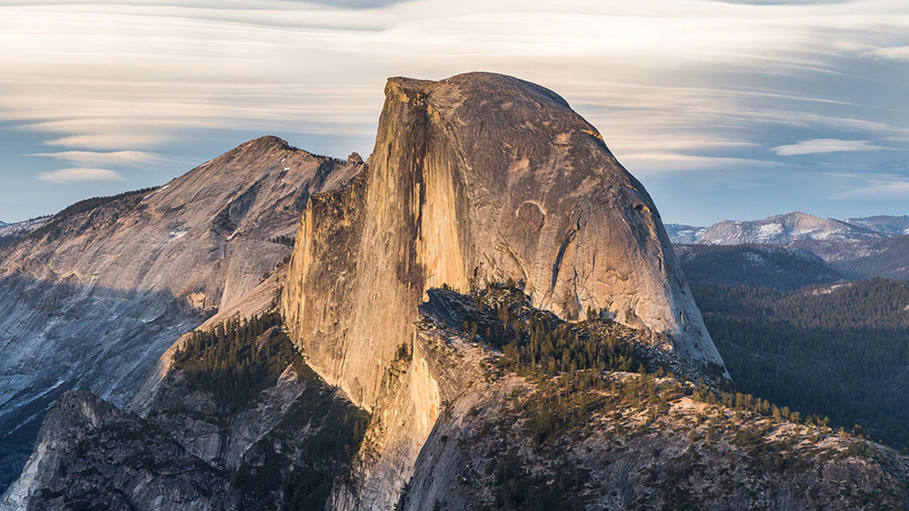
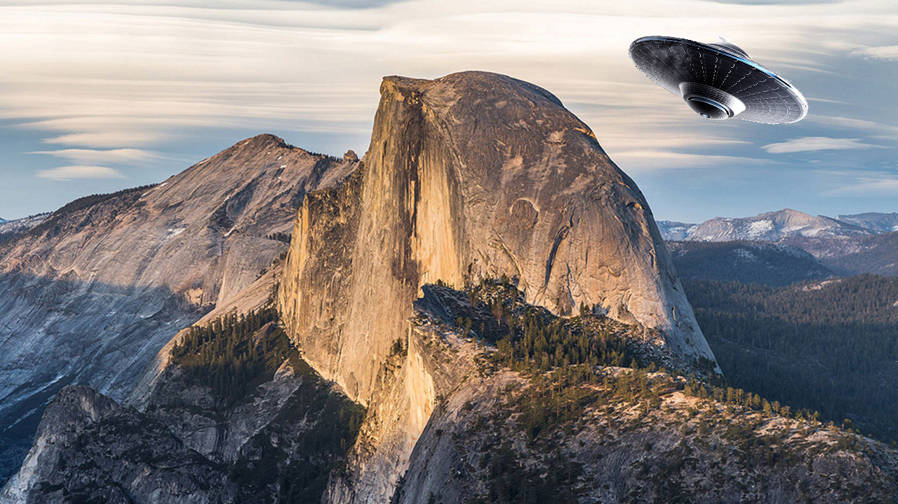
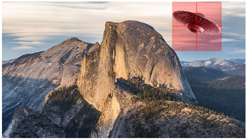

The Authedia Protocol sets the standard for proving the authenticity of digital media. This service is freely available to developers. The Authedia Protocol can be leveraged for [proof of ownership](https://github.com/Authedia/Developers#wrap-media) - registering media originated from your application. As well as [verifying the authenticity](https://github.com/Authedia/Developers#verify-media) of digital media.


### Getting Started
1. Register for an API key
  * Create an account and register for a key [here](http://www.authedia.com/)
2. Call the Authedia API in your application

### Supported File Types
* Audio
  * wav
* Images
  * png
  * jpeg
* Video
  * mp4

### Provided Languages
* [Python](https://github.com/Authedia/Developers/tree/python)
* [Go](https://github.com/Authedia/Developers/tree/go)

# Documentation

### Wrap Media
* Inserts secret information into the media file which can later be unwrapped to prove ownership
  * Note: Wrapping media with the API will not prove authenticity, only ownership. As we are not able to ascertain the origin of the media file. To capture verifiable authentic media use our [mobile app](http://www.authedia.com/)


**Wrap(api_key, input_file_name, output_file_name)**  
  * api_key : (str) : User's API key
  * input_file_name : (str) : Path to input file
  * output_file_name : (str) : Desired location of output file

Returns  
* wrap_response : (dict) : See below for key value info

```
{
    'Success' : bool : successfully processed
    'Message' : str  : error message if request is unsuccessful
}
```

### Verify Media
* Unwraps secret information from the media file. The ownership and authenticity will be determined. Detailed information regarding the originality of the media will be returned.


**Verify(api_key, input_file_name)**  
  * api_key : (str) : User's API key
  * input_file_name : (str) : Path to input file

Returns  
  * verify_response : (dict) : See below for key value info

```
{
    'Bounds'  : str  : Original size of media
    'Source'  : str  : Origin of the wrapped media
    'Success' : bool : Successfully processed
    'Message' : str  : Error message if request is unsuccessful
    'VerifiedBlocks' : list[ [bool, x, y] ] : successfully verified. (x, y) position in the data; (y) is only included for image files (png and jpeg)
    'DataBlock' : dict : {
        'DateTime' : str  : Date time media was captured
        'Device'   : str  : Type of device media was captured on
        'Location' : dict : {
            'LatLong' : str : 'lat,long'
            'Time' : str : Time the location was captured
        }
    }
}
```

### Example

| Original | Tampered | Authedia Verified |
| -------- | -------- | ----------------- |
|  |  |  |


```python
import authedia
import numpy as np
import matplotlib.pyplot as plt
from matplotlib.patches import Rectangle
from PIL import Image

your_api_key = '...'


authedia.Wrap(
    api_key=your_api_key,
    input_file_name='Figures/PNG.png',
    output_file_name='wrap_output.png'
)

x_offset = 896
y_offset = 50

# LOAD IMAGES
im = np.array(Image.open('wrap_output.png'))
ufo = np.array(Image.open('Figures/ufo.png'))[::2, ::2]

y,x,c = ufo.shape
idx = np.zeros((y, x, 3))
idx[:,:,:] = ufo[:,:,-1:] != 0
idx = idx.astype(np.bool)

# EDIT IMAGE
tmp = im[y_offset:y+y_offset, x_offset:x+x_offset]
tmp[idx] = ufo[:,:,:3][idx]

Image.fromarray(im).save('corrupted.png')

response = authedia.Verify(
    api_key=your_api_key,
    input_file_name='corrupted.png'
)


fig,ax = plt.subplots(1)
fig = ax.imshow(im)

for b, x, y in response['VerifiedBlocks']:
    if not b:
        ax.add_patch(
            Rectangle((x, y), 128, 128, edgecolor='r', alpha=0.3, facecolor='r')
        )

plt.axis('off')
fig.axes.get_xaxis().set_visible(False)
fig.axes.get_yaxis().set_visible(False)
plt.savefig('Figures/verified_image.png',bbox_inches='tight', pad_inches=0)
```
